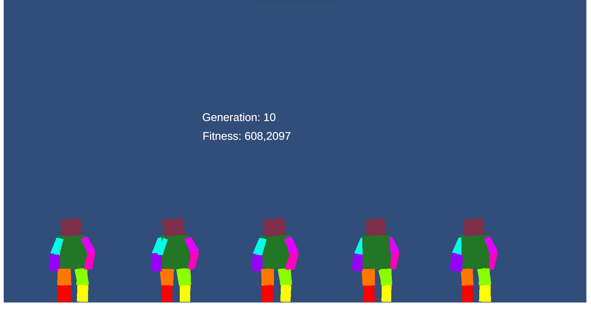

#Group 
- Bernardo Rodrigues Tameirão - 12733212

# Unity 2D Evolutionary Balancing Project



## Overview

[**Video demonstration**](https://www.youtube.com/watch?v=4_hLVEYFEcA)

This Unity project harnesses evolutionary algorithms to instruct a 2D body in maintaining balance. The primary goal is to delve into and apply evolutionary algorithms within the context of a straightforward physics simulation.

## Getting Started

### Prerequisites

- Unity3D, version 2022.3.13 (required for project compatibility)

### Installation

You can either download precompiled binaries for your platform or follow these steps:

1. Clone the repository to your local machine.

```bash
git clone https://github.com/your-username/your-repository.git
```

2. Open the Unity project in Unity3D.

## Usage

1. Open the Unity scene.

2. Press the play button to initiate the simulation.

## Evolutionary Algorithm Details

The algorithm dynamically determines the angles for each joint, leveraging the agent's height to calculate fitness. Employing elitist selection with uniform crossover proved optimal for this scenario, given the problem's simplicity.

## Results

The experiment yielded success as we systematically experimented with different parameters, efficiently "teaching" the agents to stand up.

## License

This project is open-source and licensed under the [MIT License](LICENSE.md). See the [LICENSE.md](LICENSE.md) file for details.

Feel free to contribute, modify, and share this project!
